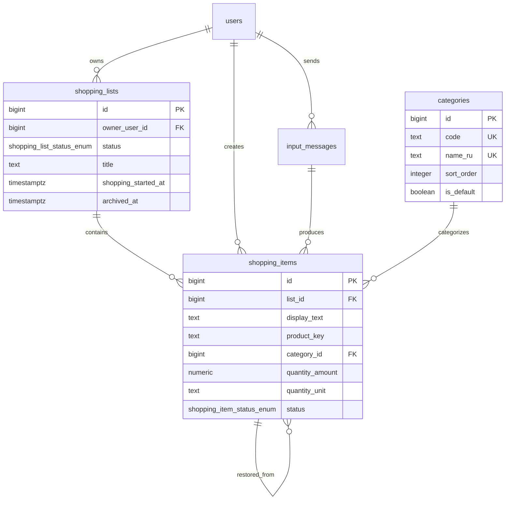
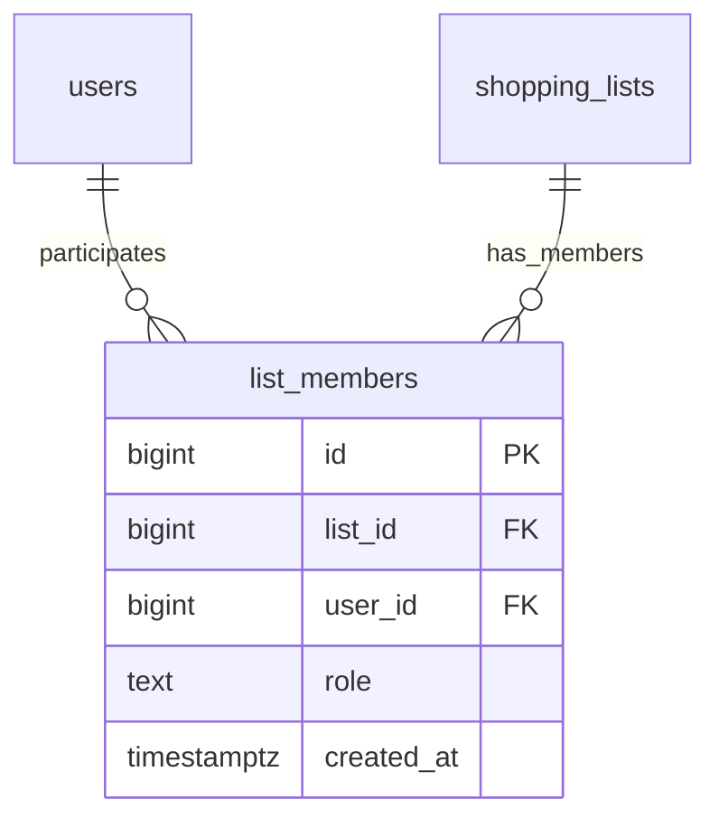

# Database Schema

Дата: 2026-08-08

## Решение по AI и парсингу

На текущем этапе MVP работает без OpenAI/AI fallback в runtime.

Пайплайн:

1. Локально разбираем сообщение на товары.
2. Локально нормализуем текст.
3. Локально пытаемся выделить количество и единицу.
4. Локально ищем категорию в словаре/правилах.
5. Если товар не удалось распознать, сохраняем его как есть и кладем в категорию `Прочие`.

Пример пользовательского fallback-сообщения:

```text
Добавил: манго сушеное
Пока не удалось распознать категорию, положил в "Прочие".
```

Пользователь не должен отвечать на уточняющие вопросы. Скорость важнее идеальной классификации.

## Enum Strategy

В коде все constant string и enum-like значения должны жить в классах с суффиксом `Enum`.

На уровне PostgreSQL используем разные подходы:

- PostgreSQL enum только для стабильных state machine значений.
- `text + CHECK` для значений, которые похожи на enum, но могут расширяться.
- lookup table для значений с метаданными, отображаемыми именами и сортировкой.
- plain `text` для внешних, пользовательских или operational metadata значений.

## PostgreSQL Enum Types

Используем только два DB enum:

```sql
create type shopping_list_status_enum as enum (
  'draft',
  'shopping',
  'archived'
);

create type shopping_item_status_enum as enum (
  'pending',
  'bought'
);
```

Причина: это стабильные состояния доменной модели и жизненного цикла чеклиста.

## Поля и типы

| Поле | DB-тип | Почему |
|---|---|---|
| `shopping_lists.status` | `shopping_list_status_enum` | Стабильный lifecycle: `draft`, `shopping`, `archived`. |
| `shopping_items.status` | `shopping_item_status_enum` | Стабильный checklist state: `pending`, `bought`. |
| `shopping_items.quantity_unit` | `text` | Единицы живые и грязные: `л`, `литр`, `кг`, `пачка`, `банка`; не зажимаем enum. |
| `input_messages.parser_source` | `text + CHECK` | MVP: `local`, `fallback`; позже можно расширить. |
| `categories.code` | `text unique` в lookup table | Категория имеет metadata: имя, сортировка, fallback. |
| `categories.name_ru` | `text` | User-facing label, может меняться без миграции enum. |
| `users.language_code` | `text` | Внешнее значение Telegram/IETF-like. |
| `users.timezone` | `text` | IANA timezone string, список внешний и большой. |

Поля `model_name`, `classifier_version`, `raw_response` сейчас не нужны, потому что MVP не использует AI. Их можно добавить позже вместе с AI-классификатором.

## Tables

### `users`

| Поле | Тип | Описание |
|---|---|---|
| `id` | `bigint generated always as identity primary key` | Внутренний ID. |
| `telegram_user_id` | `bigint not null unique` | ID пользователя Telegram. |
| `telegram_username` | `text null` | Username, если есть. |
| `first_name` | `text null` | Имя из Telegram. |
| `last_name` | `text null` | Фамилия из Telegram. |
| `language_code` | `text null` | Язык пользователя. |
| `timezone` | `text null` | На будущее для локальных дат. |
| `is_blocked` | `boolean not null default false` | Пользователь заблокировал бота или недоступен. |
| `last_seen_at` | `timestamptz null` | Последнее событие от пользователя. |
| `created_at` | `timestamptz not null default now()` | Создание записи. |
| `updated_at` | `timestamptz not null default now()` | Последнее обновление. |

### `shopping_lists`

| Поле | Тип | Описание |
|---|---|---|
| `id` | `bigint generated always as identity primary key` | ID списка. |
| `owner_user_id` | `bigint not null references users(id)` | Владелец списка. |
| `status` | `shopping_list_status_enum not null` | `draft`, `shopping`, `archived`. |
| `title` | `text null` | Название, например `Покупки 2026-08-08`. |
| `shopping_started_at` | `timestamptz null` | Когда нажали `Начать покупки`. |
| `archived_at` | `timestamptz null` | Когда нажали `Завершить`. |
| `archived_by_user_id` | `bigint null references users(id)` | Кто завершил список; задел под shared lists. |
| `created_at` | `timestamptz not null default now()` | Создание списка. |
| `updated_at` | `timestamptz not null default now()` | Последнее обновление. |

```sql
create unique index shopping_lists_one_current_per_owner_uidx
on shopping_lists (owner_user_id)
where status in ('draft', 'shopping');
```

### `categories`

| Поле | Тип | Описание |
|---|---|---|
| `id` | `bigint generated always as identity primary key` | ID категории. |
| `code` | `text not null unique` | Стабильный код: `dairy`, `bakery`, `other`. |
| `name_ru` | `text not null unique` | Название: `Молочные продукты`, `Прочие`. |
| `sort_order` | `integer not null default 1000` | Порядок показа в списке. |
| `is_default` | `boolean not null default false` | Fallback-категория `Прочие`. |
| `created_at` | `timestamptz not null default now()` | Создание записи. |
| `updated_at` | `timestamptz not null default now()` | Последнее обновление. |

```sql
create unique index categories_one_default_uidx
on categories (is_default)
where is_default = true;
```

### `input_messages`

| Поле | Тип | Описание |
|---|---|---|
| `id` | `bigint generated always as identity primary key` | ID сообщения. |
| `user_id` | `bigint not null references users(id)` | Кто отправил. |
| `telegram_chat_id` | `bigint not null` | Telegram chat ID. |
| `telegram_message_id` | `bigint not null` | Telegram message ID. |
| `raw_text` | `text not null` | Исходный текст пользователя. |
| `parser_source` | `text not null` | `local` или `fallback` в MVP. |
| `parser_version` | `text null` | Версия локального парсера. |
| `parser_metadata` | `jsonb null` | Диагностика парсинга, если нужна. |
| `received_at` | `timestamptz not null` | Время сообщения из Telegram. |
| `created_at` | `timestamptz not null default now()` | Когда сохранено в БД. |

```sql
check (parser_source in ('local', 'fallback'));
unique (telegram_chat_id, telegram_message_id);
```

### `shopping_items`

| Поле | Тип | Описание |
|---|---|---|
| `id` | `bigint generated always as identity primary key` | ID товара. |
| `list_id` | `bigint not null references shopping_lists(id) on delete cascade` | Список. |
| `created_by_user_id` | `bigint not null references users(id)` | Кто добавил товар. |
| `source_input_message_id` | `bigint null references input_messages(id)` | Из какого сообщения создан товар. |
| `restored_from_item_id` | `bigint null references shopping_items(id)` | Если восстановлен из архива. |
| `display_text` | `text not null` | Исходный текст для показа: `2 литра молока`. |
| `product_key` | `text not null` | Нормализованный ключ или нормализованный исходный текст. |
| `category_id` | `bigint not null references categories(id)` | Категория, fallback `Прочие`. |
| `quantity_amount` | `numeric null` | Распознанное количество, если уверенно. |
| `quantity_unit` | `text null` | Единица измерения как текст. |
| `status` | `shopping_item_status_enum not null default 'pending'` | `pending` или `bought`. |
| `position` | `integer not null` | Порядок товара внутри списка. |
| `bought_at` | `timestamptz null` | Когда отмечен купленным. |
| `bought_by_user_id` | `bigint null references users(id)` | Кто отметил купленным. |
| `created_at` | `timestamptz not null default now()` | Создание товара. |
| `updated_at` | `timestamptz not null default now()` | Последнее обновление. |

```sql
check (length(btrim(display_text)) > 0);
check (length(btrim(product_key)) > 0);
check (
  (status = 'pending' and bought_at is null and bought_by_user_id is null)
  or
  (status = 'bought' and bought_at is not null and bought_by_user_id is not null)
);
```

### `product_classification_cache`

На MVP можно не создавать. Пока категорийный lookup делается локальным словарем в коде.

Добавить эту таблицу позже, если появится AI fallback, расширенный словарь или общий кэш нормализации товаров.

## Indexes

```sql
create index shopping_lists_owner_status_created_idx
on shopping_lists (owner_user_id, status, created_at desc);

create index shopping_lists_owner_archived_idx
on shopping_lists (owner_user_id, archived_at desc)
where status = 'archived';

create index shopping_items_list_category_position_idx
on shopping_items (list_id, category_id, position);

create index shopping_items_list_status_idx
on shopping_items (list_id, status);

create index shopping_items_source_input_message_id_idx
on shopping_items (source_input_message_id);

create index shopping_items_restored_from_item_id_idx
on shopping_items (restored_from_item_id);

create index input_messages_user_received_idx
on input_messages (user_id, received_at desc);
```

## ER Diagram



## Future Shared Lists Schema

Этот раздел сохраняет будущую схему для shared/family lists. В MVP таблицу `list_members` не создаем и не реализуем collaborative UX.

### `list_members`

Участники списка. В MVP список принадлежит одному `owner_user_id` в `shopping_lists`; эта таблица нужна только при добавлении общего списка.

| Поле | Тип | Описание |
|---|---|---|
| `id` | `bigint generated always as identity primary key` | ID membership-записи. |
| `list_id` | `bigint not null references shopping_lists(id) on delete cascade` | Список. |
| `user_id` | `bigint not null references users(id) on delete cascade` | Участник. |
| `role` | `text not null` | `owner`, `member`; `text + CHECK`, чтобы позже расширить роли. |
| `created_at` | `timestamptz not null default now()` | Когда добавлен участник. |

```sql
check (role in ('owner', 'member'));
unique (list_id, user_id);

create index list_members_user_id_idx
on list_members (user_id);

create index list_members_list_id_idx
on list_members (list_id);
```

### Future ER Fragment


